# 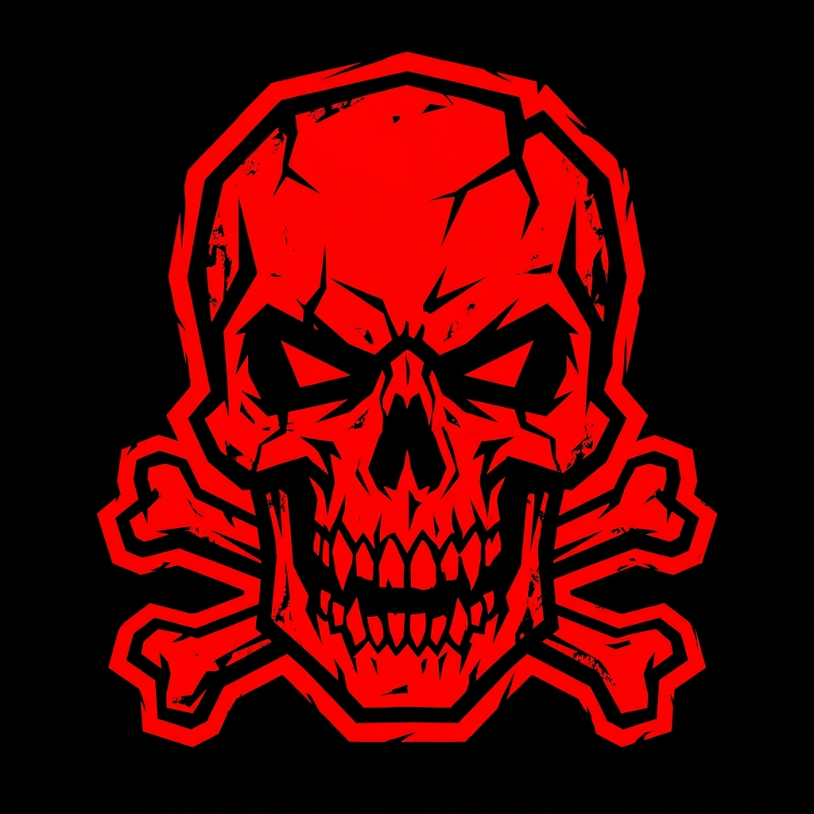 Лабораторна робота №14 // Музичний гурт «NEKROKORP»

**Дисципліна:** Веб-технології та веб-дизайн  
**Тема:** Створення адаптивного веб-інтерфейсу з використанням Tailwind CSS  
**Варіант:** №14 (Музичний гурт)  
🔗 **Live Preview:** [Перейти на Live сайт на Render](https://metal-website-render.onrender.com)

---

##  ВІЗУАЛЬНИЙ ОГЛЯД / СКРІНШОТИ СЕКЦІЙ

### 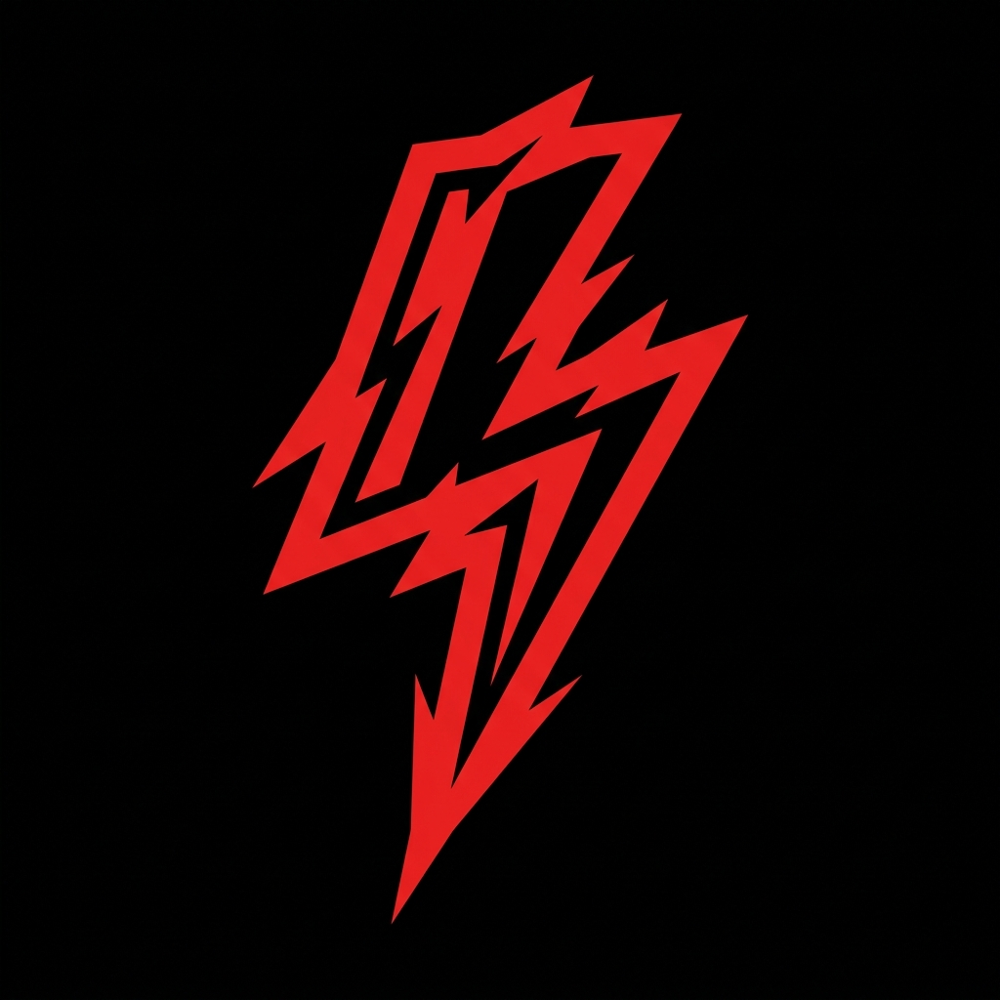 1. Головний екран та хедер (Hero & Header)
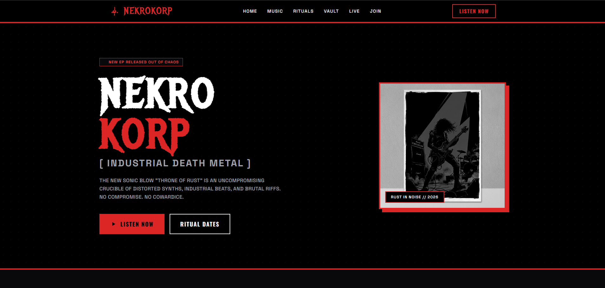

### 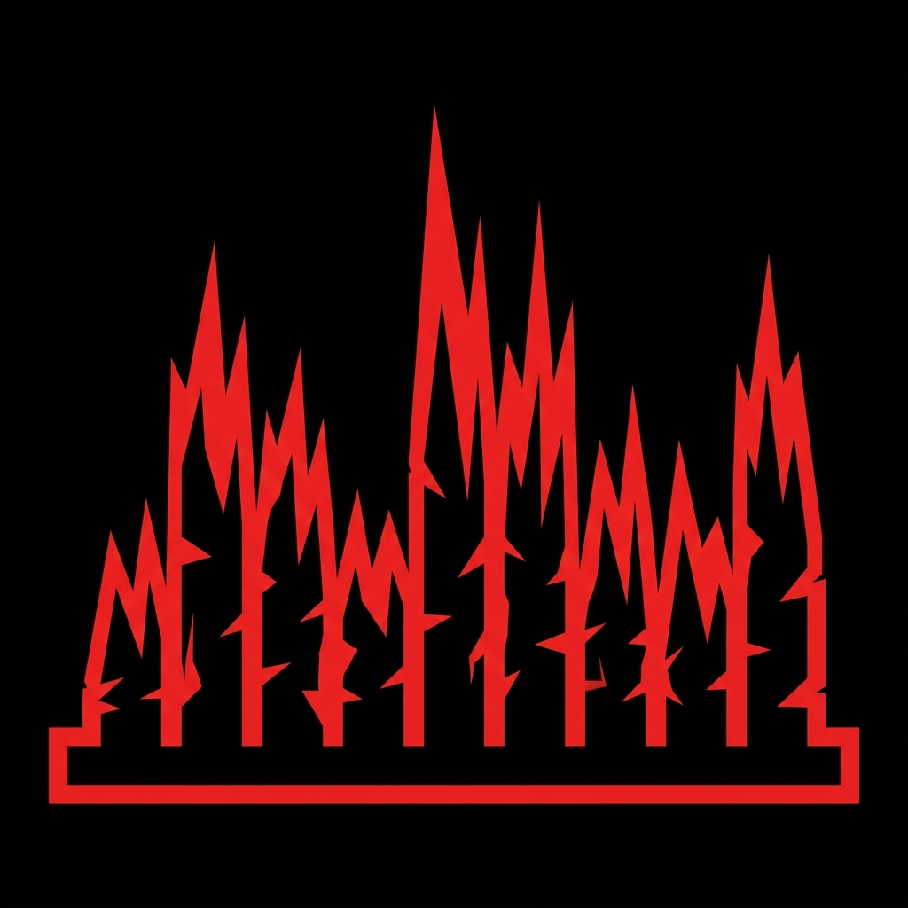 2. Кастомний аудіоплеєр (Player)
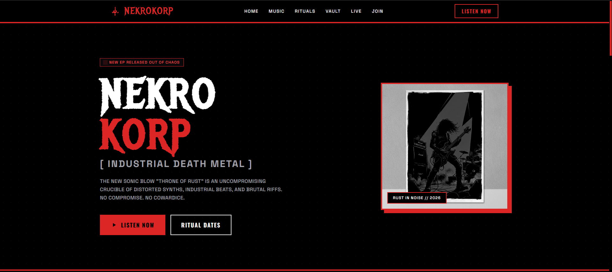

### 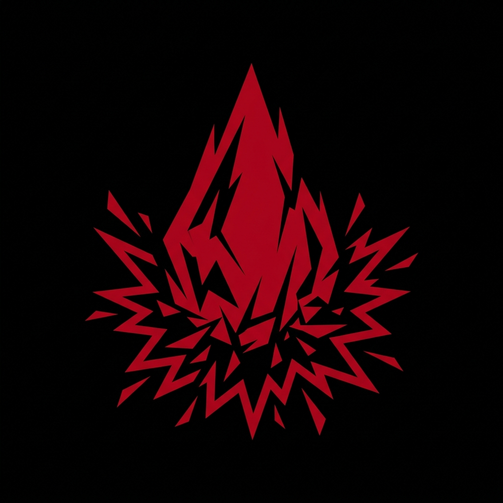 3. Афіша концертів (Tour Schedule)
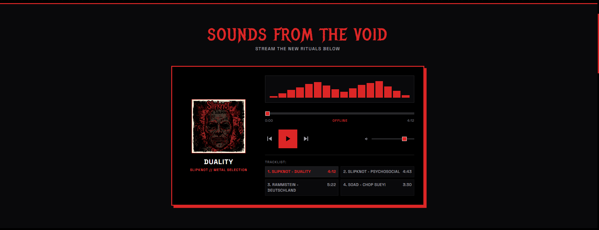

### 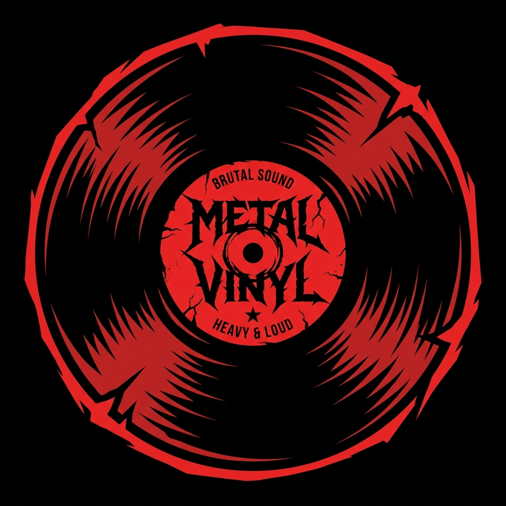 4. Дискографія гурту (Releases)
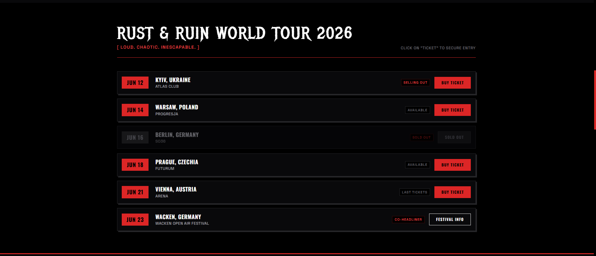

### 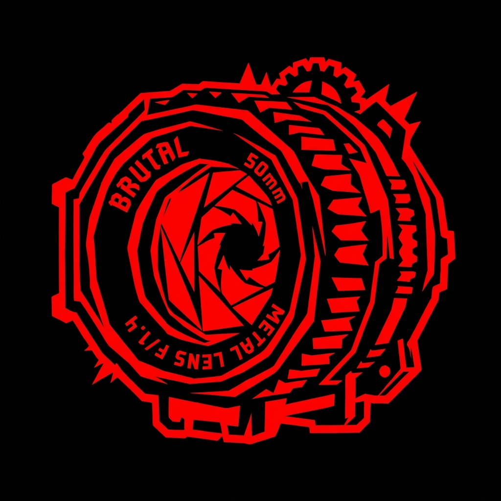 5. Фотогалерея (Live Gallery)
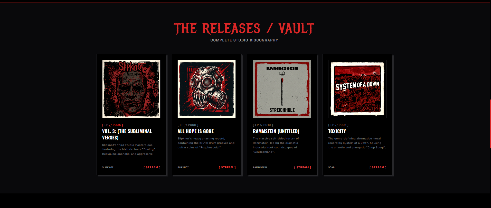

### 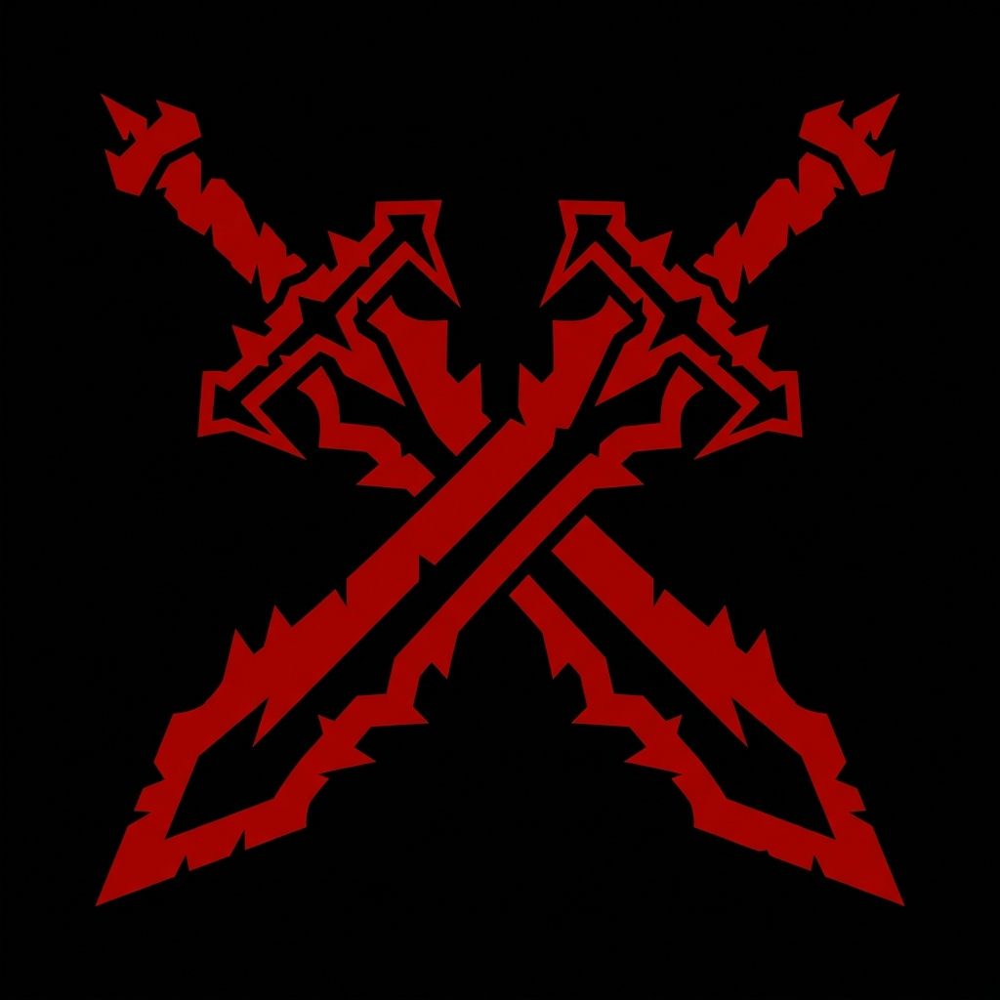 6. Форма підписки (Newsletter Form)
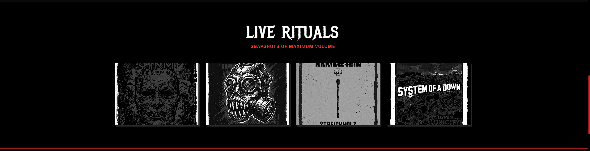

###  7. Інформаційний Footer
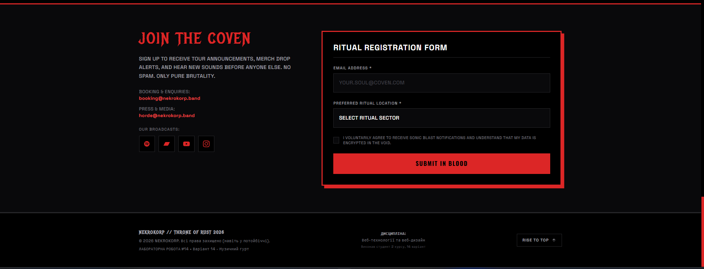
